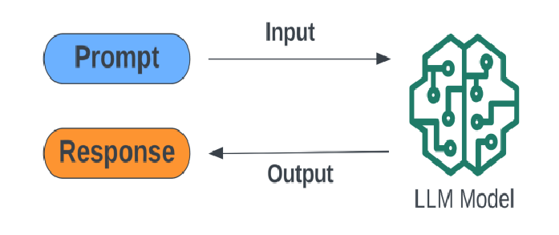
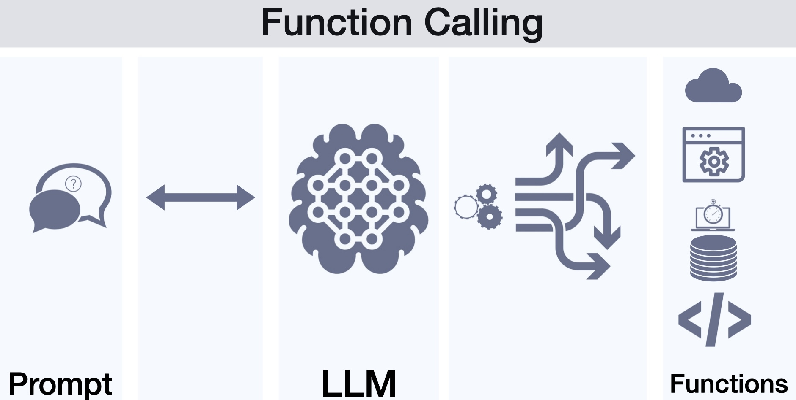
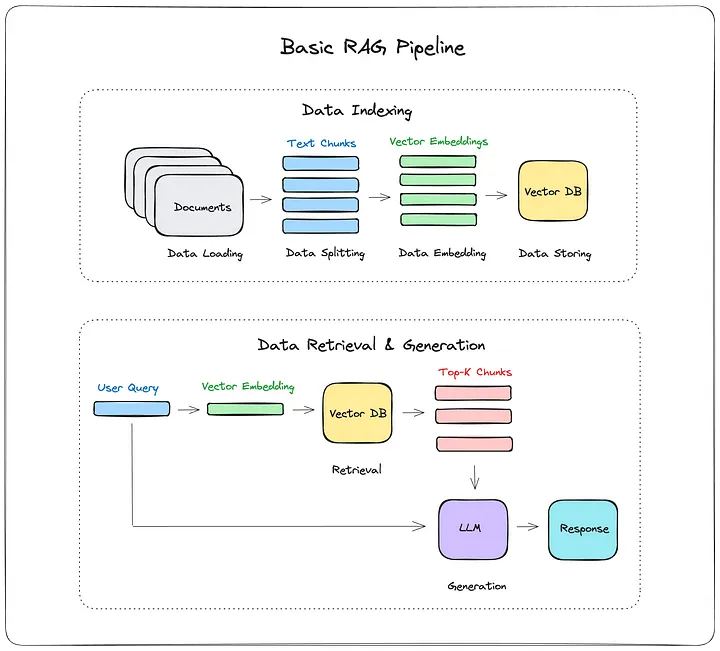
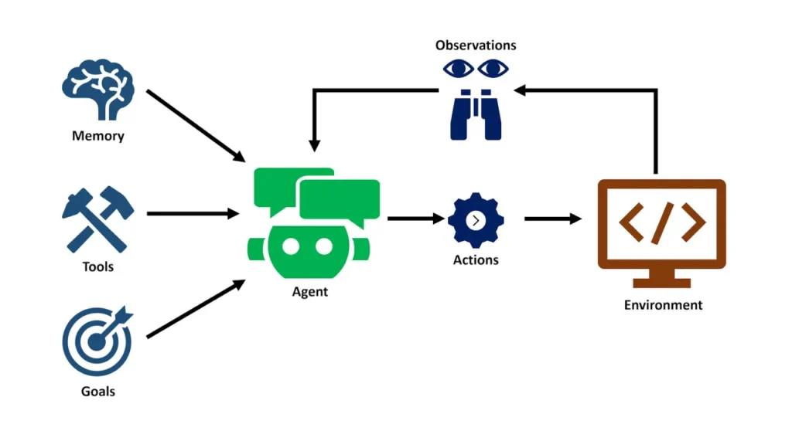
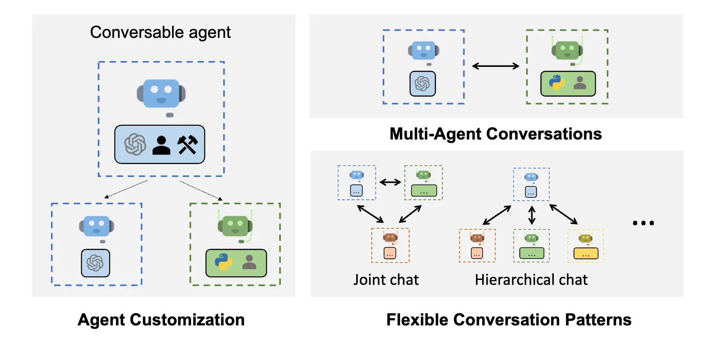

Welcome to AI4SE Tutorial

Discover the power of Artificial Intelligence in Software Engineering with this interactive tutorial.

Lets set things up.

Follow this notebook for the Tutorial:
[Tutorial Notebook](https://colab.research.google.com/drive/1hfHzBwHfIhiPXAewub8QJejJxy6nsKrA?usp=sharing)

Now we setup Gemini. Do the following:
- Generate Your API Key
  - Go to [Google AiStudio Api Key](https://aistudio.google.com/app/apikey)
  - Generate Key.
  - Provide any necessary permissions when prompted.

- Add Your API Key to Colab
  - Open your Google Colab notebook.
  - On the left panel, click the 🔑 "Secrets" icon.
  - Click "+ Add a new secret".
  - 'Name' is you key name, and 'Value' is the key

- Configure the API Key in Your Code
  - Change the name in the 3rd cell if needed:  GOOGLE_API_KEY=userdata.get('**Key_Name**')
  - Colab will ask for permission to access your secrets. Grant access to proceed. 

---

# Content

## 1. Prompting

 
<small>Image credit: <a href="https://www.researchgate.net/publication/379483765_The_Power_of_Prompt_Engineering_Refining_Human_-AI_Interaction_with_Large_Language_Models_in_The_Field_of_Engineering">The Power of Prompt Engineering: Refining Human -AI Interaction with Large Language Models in The Field of Engineering</a></small>
 

💡 Prompting involves crafting effective instructions or queries to guide AI models (LLMs) in generating desired outputs.
🧠 LLMs might often need a greater context (History) rather than just the user input to generate a response.

## 2. Function Calling

 
<small>Image credit: <a href="https://gradientflow.substack.com/p/expanding-ai-horizons-the-rise-of">Expanding AI Horizons: The Rise of Function Calling in LLMs</a></small>
 

🔧 Function calling lets a language model go beyond text generation by triggering external tools or APIs based on the user's prompt. When the model detects that a specific task—like retrieving weather data, running code, querying a database, or automating a process—is needed, it calls a predefined function with the appropriate inputs.

These functions can do things like:

- Access cloud services (e.g., weather or maps)
- Run backend processes or scripts
- Query databases
- Execute code or automation tasks

🤖 The model then uses the function's output to generate a final, informed response. This turns the model into a powerful agent that can interact with external systems dynamically.

## 3. Retrieval-Augmented Generation (RAG)

 
<small>Image credit: <a href="https://medium.com/@drjulija/what-is-retrieval-augmented-generation-rag-938e4f6e03d1">How I built a Simple Retrieval-Augmented Generation (RAG) Pipeline</a></small>
 

#### **1. Data Indexing**
*This stage prepares documents for retrieval later.*

- **Data Loading:** Raw documents are collected and loaded.
- **Data Splitting:** Documents are split into smaller text chunks (e.g., paragraphs, sentences).
- **Data Embedding:** Each chunk is converted into a vector embedding using an embedding model. These are numerical representations that capture the semantic meaning of the text.
- **Data Storing:** The embeddings are stored in a Vector Database (Vector DB), which enables fast similarity search.

#### **2. Data Retrieval & Generation**
*This stage is triggered when a user asks a question.*

- **User Query:** A user submits a question.
- **Vector Embedding:** The query is converted into a vector (like the document chunks).
- **Retrieval:** The vector DB is queried with the query embedding to retrieve the most relevant Top-K Chunks.
- **Generation:**
  - The retrieved chunks are passed to a Large Language Model (LLM).
  - The LLM uses this context to generate a response.

## 4. Agentic AI

 
<small>Image credit: <a href="https://k21academy.com/ai-ml/agentic-ai/what-is-agentic-ai/">What is Agentic AI | K21Academy</a></small>
 

🤖 Agentic AI refers to AI systems that can act as autonomous agents, making decisions, using tools, collaborating with others, and adapting to complex tasks over time.

🔧 **Agent Customization** 
Agentic AI allows you to build specialized agents by customizing:
- Capabilities (e.g. access to specific tools or APIs)
- Behavior (how they interact or respond)
- Roles (like data analyst, assistant, or coder)

🧠 **Agent Architecture** 
An agent can be powered by
- Memory (to remember past actions)
- Tools (to interact with the world, like APIs or functions)
- Goals (what the agent is trying to achieve)

🤖 **Multi-Agent Conversations**
Agentic systems involve multiple agents working together. This supports collaborative problem-solving, with agents sharing results or coordinating workflows. They can have various communication patterns.
- Joint chat: Multiple agents interact simultaneously.
- Hierarchical chat: One lead agent delegates tasks to others.

🔁 **Flexible Interaction Patterns**
Agents aren't limited to user prompts—they
- Interact with each other
- Trigger actions autonomously
- Update plans dynamically

 
<small>Image credit: <a href="https://microsoft.github.io/autogen/stable/">AutoGen</a></small>
 

---

## Instructors

  

    
    
<b>Karthik Vaidhyanathan</b>

    
Assistant Professor, IIIT Hyderabad

  

  

    
    
<b>Rudra Dhar</b>

    
PhD Student, IIIT Hyderabad

  

